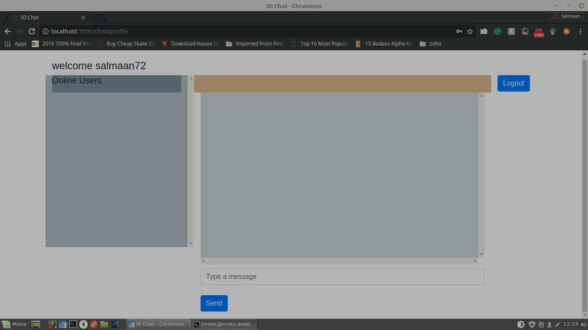
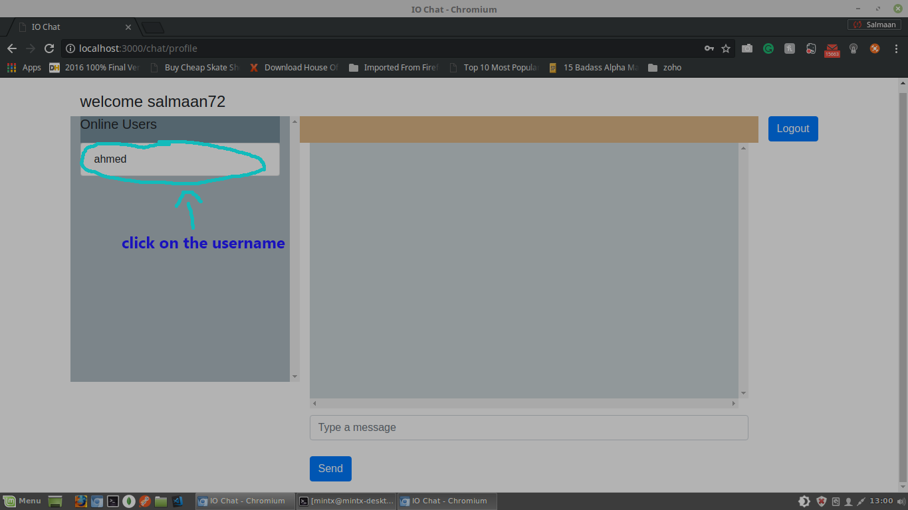
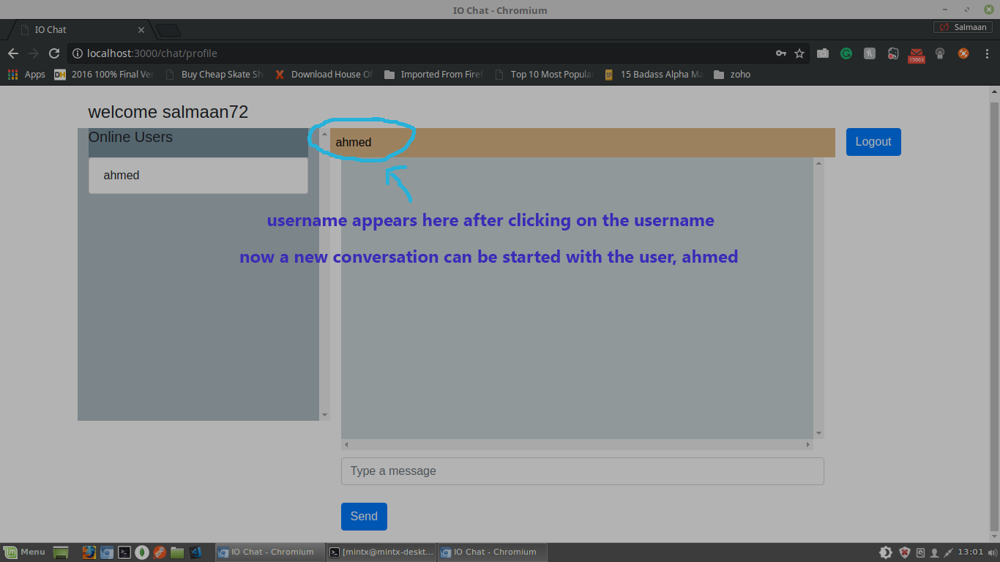
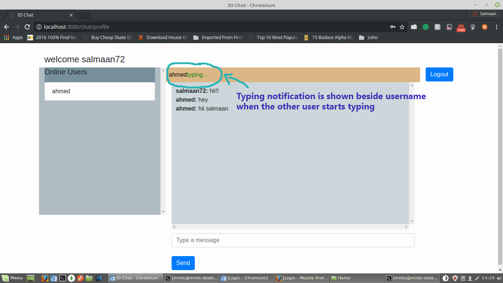

# chat-app
A simple chat application developed using socket.io
## Installation
1. clone the repository
2. navigate into the cloned repo directory and install the dependencies by issuing the command `npm install`
3. start the server: `nodemon app.js` or `node app.js`
4. entry route: `localhost:3000/chat/login`

## Points to remember
1. click on any one of the users under 'users online' field to start a conversation.
2. If the server is restarted while the app is in use, logout all the currently loggedin sessions and login again.
3. Features persistent storage but old chats of a particular conversation are only be accessible when the other person in the conversation is currently online. (because only then the username is displayed under the online users tab)

###### Note: Interested in frontend development?, fork the repo.

As this is a backend development course, I haven't emphasized much on GUI. The sole intention was to have a proper understanding of socket.io. I kindly request you to evaluate on the basis of backend code.
## How to use the app
1. signup and login with registered username and password.
2. After login user will be directed to a page with url `localhost:3000/chat/profile`. which looks something like this:
  

3. To start a conversation with a user click on the username below 'online users' tab.
  

4. Then the username of the user to start a conversation with, appears on the top of the chat box.
  

5. Typing notification: only the users in a conversation can see the other person typing.
  

6. Features persistent storage:
Try loggingout a user, login again and tap on the username under 'online users' tab, all the messages will be restored back on the chat box.

 
